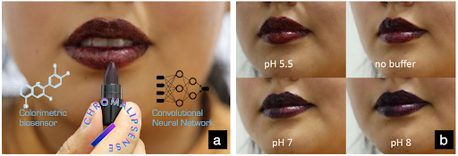

# ChromaLipSense: Lipstick-Based Biosensors for Metabolic Monitoring

This repository contains the study code for the paper "ChromaLipSense: Lipstick-Based Biosensors for Metabolic Monitoring" In WEARABLES COLLECTIVE (WC '24), March 25-26, 2024.

## Overview

ChromaLipSense introduces a novel approach to metabolic monitoring by integrating biosensors with a widely-used beauty product: lipstick. This project represents a significant advancement in the field of **Biocosmetic interfaces**, where cosmetics are used as platforms for health monitoring.

**ChromaLipSense** is a lipstick-based biosensor that detects pH levels in saliva through colorimetric analysis. By leveraging the unique properties of lipstick—such as its direct contact with saliva, frequent use, and discreet application—ChromaLipSense offers a non-invasive, real-time method for monitoring biochemical changes in the body. The embedded biosensor responds to pH variations, providing a visually intuitive display of metabolic information.

This innovative approach addresses the limitations of existing biosensor technologies, such as invasiveness and the need for frequent calibration. Additionally, the project includes a DIY fabrication process for creating biosensor lipstick with natural pigments and skin-safe buffers. The integration of machine learning algorithms further enhances the accuracy and robustness of pH detection, even under varying lighting conditions.

ChromaLipSense not only advances the concept of biocosmetic interfaces but also opens new possibilities for personalized and continuous health monitoring through everyday beauty products.

## Authors

- **Shuyi Sun** - University of California, Davis, USA
- **Yuan-Hao Ku** - University of California, Davis, USA
- **Jae Yong Suk** - University of California, Davis, USA
- **Ali K. Yetisen** - Imperial College London, UK
- **Katia Vega** - University of California, Davis, USA

## Abstract

This research presents a lip-based biosensor that utilize colorimetric changes to display pH levels. These biosensors offer an always-available, non-invasive alternative to traditional lab-based analyses. We use a Convolutional Neural Network (CNN) model to detect pH levels.

Our dataset comprises five users, eight different lighting conditions, two cameras, and five pH levels. Results indicate that our method improves pH detection compared to conventional techniques.

## Features

- **Lipstick Biosensors**: Designed to indicate pH levels through color changes.
- **Data Collection**: Includes variations in lighting, camera conditions, and user responses.
- **Improved Detection**: Shows enhanced pH variation detection over traditional methods.

## Fabrication

### Lipstick

**Ingredients:**
- Commercial Lipstick Base from TKB (33.3%) - [Link](https://tkbtrading.com/products/lip-stick-base)
- Cetyl Alcohol (8.3%) - [Link](https://a.co/d/3L3egQI)
- Non-Nano Titanium Dioxide (8.3%) - [Link](https://a.co/d/bC0Dbmd)
- Skin Safe Primer Adhesive (8.3%) - [Link](https://a.co/d/55gygY8)
- Clear Silver Mica Powder (8.3%) - [Link](https://tkbtrading.com/collections/mica?utm_source=google&utm_medium=cpc&utm_campaign=shopping)
- Red Cabbage Powder (33.3%) - [Link](https://suncorefoods.com/products/cosmos-red-cabbage-powder)

**Instructions:**
1. Heat the lipstick base until fully melted (175ºF).
2. Mix in Cetyl Alcohol, Non-Nano Titanium Dioxide, Skin Safe Primer Adhesive until melted (175ºF).
3. Stir magnetically for around 20 minutes.
4. Lower the temperature to 165ºF.
5. Mix in Clear Silver Mica Powder and Red Cabbage Powder.
6. Stir magnetically for around 10 minutes.
7. Blend by hand for around 15 minutes.
8. Pour into a pre-chilled mold (35ºF).
9. Chill for 10 minutes before demolding.

## Software Implementation

1. **Biosensor Color Detection and CNN**: Located in the `CNNDetection` folder.
2. **Dataset**: [Link](https://drive.google.com/drive/u/2/folders/1qq6l7d5GhKywF7OMcMr4rxqVE8LBk1ne).

## Contributing

We welcome contributions to enhance the project. Please fork the repository and submit pull requests with your improvements. For major changes, please open an issue to discuss your proposal before making changes.

## Acknowledgments
This material is based upon work supported by the National Science Foundation under Grant No 2146461, and UC Davis Academic

## License

This project is licensed under the MIT License - see the [LICENSE](LICENSE) file for details.

## Contact

For any questions or inquiries, please contact us at:

- Shuyi Sun: [shuyi.sun@ucdavis.edu](mailto:shuyi.sun@ucdavis.edu)
- Yuan-Hao Ku: [yuan-hao.ku@ucdavis.edu](mailto:yuan-hao.ku@ucdavis.edu)
- Nicole Unsihuay: [nicole.unsihuay@pucp.edu.pe](mailto:nicole.unsihuay@pucp.edu.pe)
- Jae Yong Suk: [jae.yong.suk@ucdavis.edu](mailto:jae.yong.suk@ucdavis.edu)
- Ali K. Yetisen: [a.yetisen@imperial.ac.uk](mailto:a.yetisen@imperial.ac.uk)
- Katia Vega: [katia.vega@ucdavis.edu](mailto:katia.vega@ucdavis.edu)

---

Explore more about our work and stay updated with our research.
